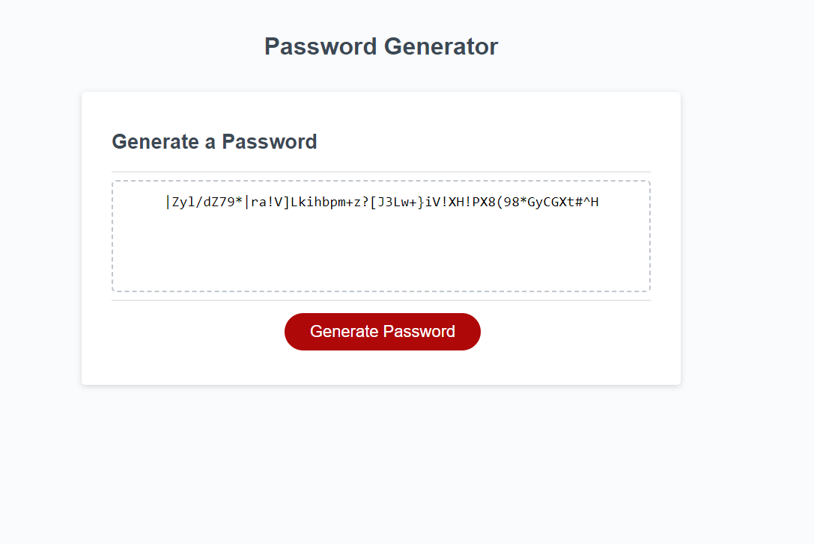

# Trippin-Over-Passwords
Randomly generates a password with various criteria that can be selected by the user. 

## Description

* My motivation for this project was to exercise my recently learned Javascript skills to create a random password generator that meets accepted critera for the user.
* I created this project so I could test my use of variables, functions and for and while statements while also having fun creating the generator.
* This project solves the problem of creating a generic password by randomly generating a password with various options such as special characters, numbers or uppercase and lowercase letters.
* I learned that dedicating your time and putting in the work is both rewarding and enlightening. I learned a lot and feel more confident in myself than I did previously.
* I feel that my project stands out because it is a piece of me that I put lots of hardwork and time into it so that I could feel proud of how far I have already come in the program.

Screenshot of page

Link to page
https://dnttstme.github.io/Trippin-Over-Passwords/

## Installation
N/A

## Usage

# User
You will be prompted with a series of questions regarding your password criteria (note, at least one must be selected, or else an error will pop up and the prompts will restart), including:
* The desired password length (on the condition that it is between 8 and 128 characters long)
* Whether you want the password to contain uppercase letters
* Whether you want the password to contain lowercase letters
* Whether you want the password to contain numbers
* Whether you want the password to contain special characters
When all prompts are answered, you will be provided with a password which is generated according to your responses

## Credits

https://youtu.be/iKo9pDKKHnc

https://youtu.be/x4HUaiazDes

https://youtu.be/W6NZfCO5SIk

https://developer.mozilla.org/en-US/docs/Web/JavaScript/Guide/Functions

https://developer.mozilla.org/en-US/docs/Web/JavaScript/Reference/Global_Objects/Math/random

https://developer.mozilla.org/en-US/docs/Web/JavaScript/Reference/Operators/Addition_assignment

## License
Please refer to the License in the repository. 